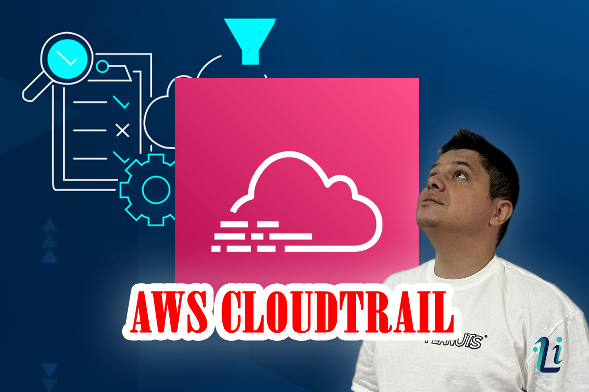
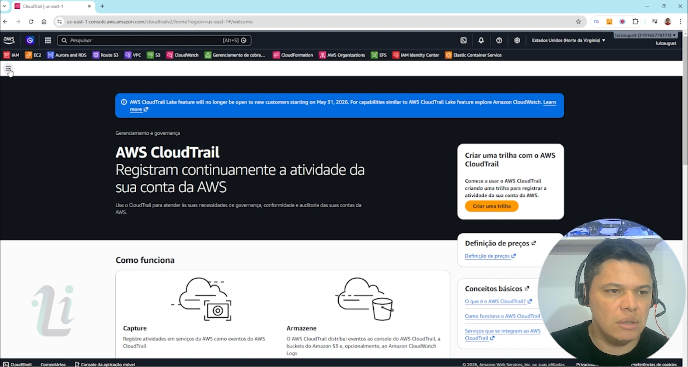
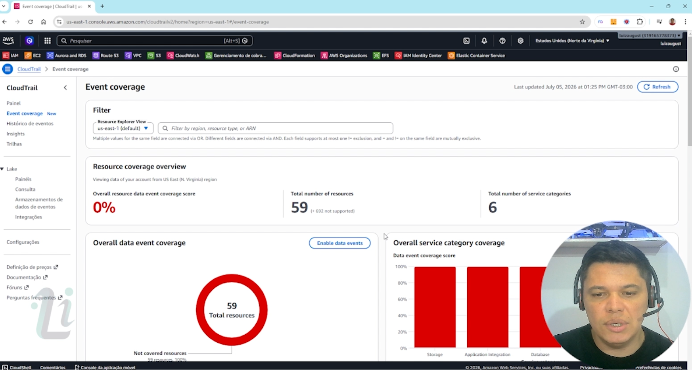
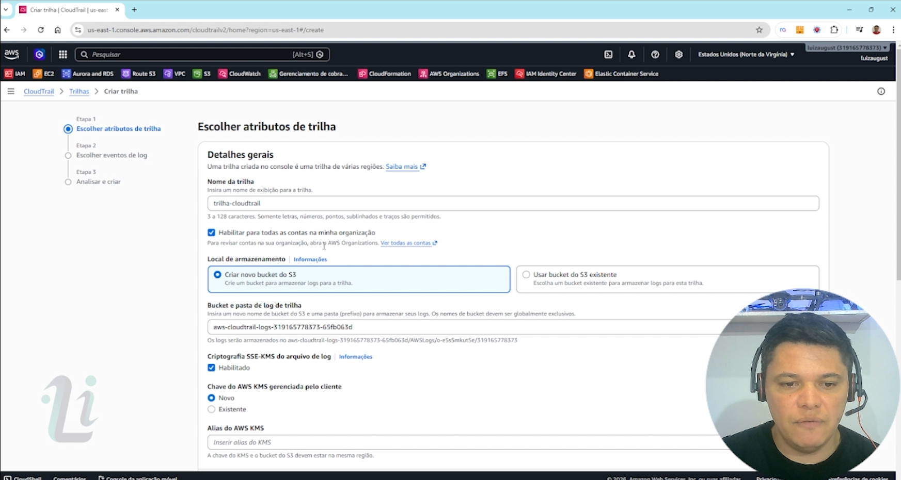
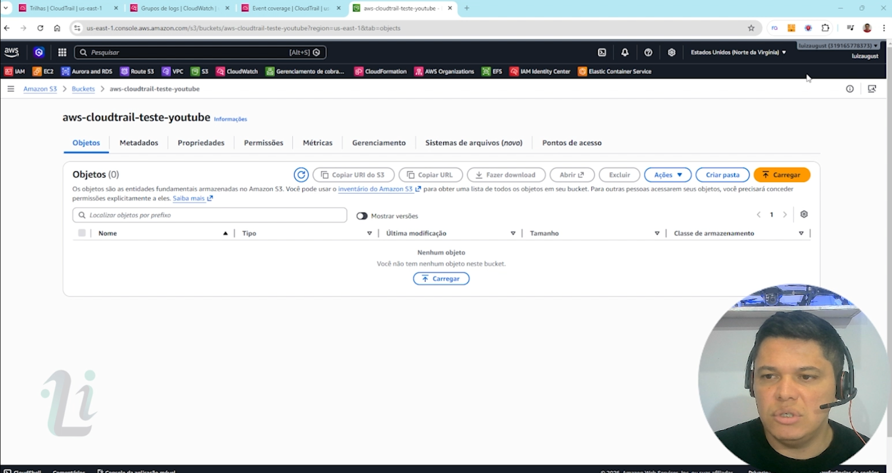
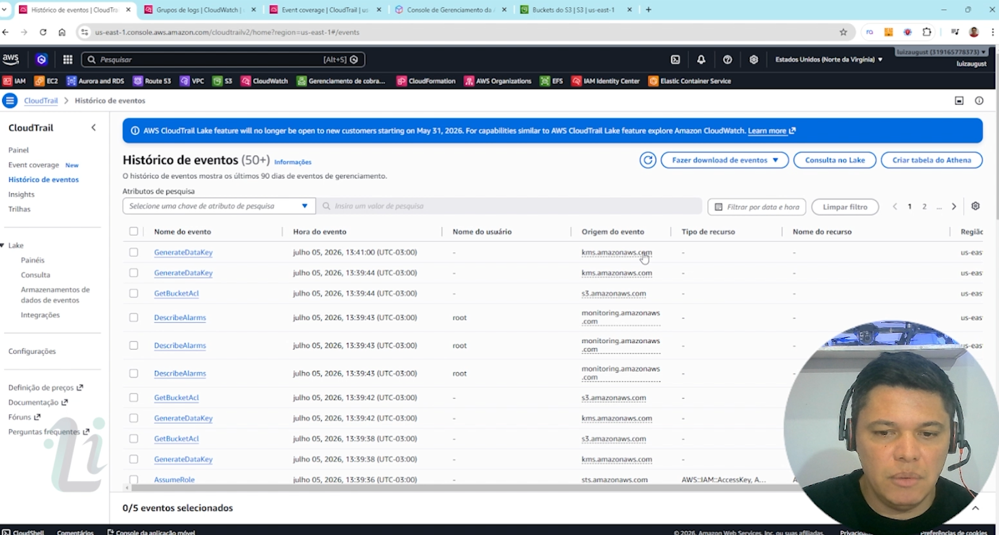
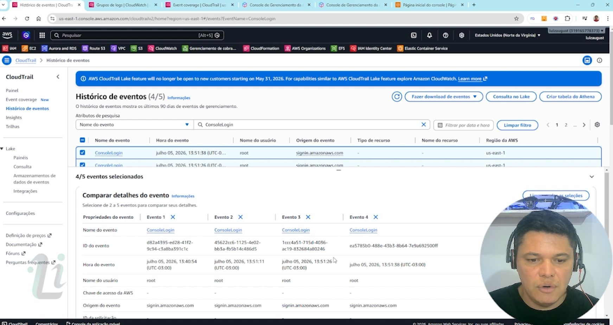
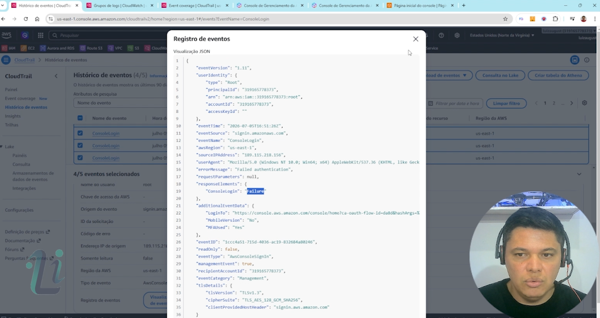
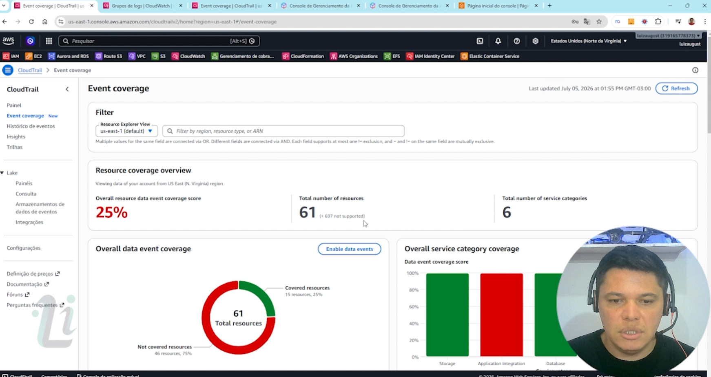
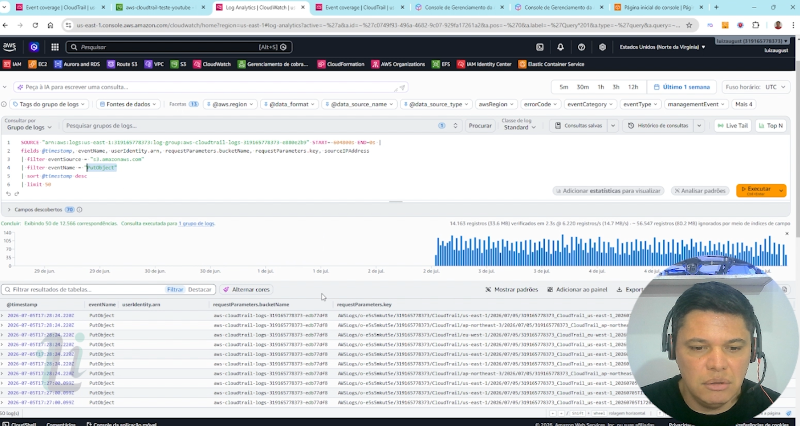

# AWS CloudTrail - Auditoria, Segurança e Governança na AWS

## Sobre o projeto

Este projeto demonstra, de forma prática, como utilizar o **AWS
CloudTrail** para auditar ações realizadas dentro de uma conta AWS.

Durante o laboratório são apresentados cenários reais de monitoramento,
investigação e auditoria, permitindo identificar **quem realizou uma
ação, quando ela ocorreu, de onde ela foi executada e quais recursos
foram afetados**.


------------------------------------------------------------------------

# Arquitetura utilizada

-   AWS CloudTrail
-   Amazon S3 (armazenamento dos logs)
-   Amazon CloudWatch Logs
-   CloudWatch Logs Insights
-   AWS Organizations (Trilha de Organização)

------------------------------------------------------------------------

# Conteúdo apresentado

## 1. O que é o AWS CloudTrail

-   Conceito
-   Casos de uso
-   Diferença entre auditoria e monitoramento
-   Como o CloudTrail registra chamadas de API

------------------------------------------------------------------------

## 2. Histórico de Eventos

Demonstração do Event History.

Exemplos:

-   Login no Console
-   Criação de Bucket
-   Criação de Security Group
-   Alterações em recursos

Também é explicado que o **Histórico de Eventos registra apenas eventos
de gerenciamento (Management Events)**.

------------------------------------------------------------------------

## 3. Trilha (Trail)

Criação de uma trilha completa contendo:

-   Multi Region
-   Organização
-   Bucket S3
-   CloudWatch Logs
-   Criptografia
-   Log File Validation

------------------------------------------------------------------------

## 4. Management Events

Demonstração prática mostrando eventos como:

-   CreateBucket
-   CreateSecurityGroup
-   ConsoleLogin
-   PutBucketEncryption
-   PutBucketVersioning

Cada evento é analisado em JSON mostrando:

-   Usuário
-   Horário
-   Região
-   IP de origem
-   Navegador
-   Serviço
-   Recurso
-   Tipo do evento

------------------------------------------------------------------------

## 6. Event Coverage

Explicação do painel Event Coverage.

É demonstrado:

-   Recursos protegidos
-   Recursos não protegidos
-   Cobertura por categoria
-   Como habilitar Data Events

------------------------------------------------------------------------

## 7. CloudTrail Insights

Apresentação do recurso CloudTrail Insights.

São explicados:

-   API Call Rate
-   API Error Rate
-   Detecção de comportamento anômalo
-   Interpretação dos gráficos

------------------------------------------------------------------------

## 8. CloudWatch Logs

Integração entre CloudTrail e CloudWatch Logs.

Consultas utilizando CloudWatch Logs Insights.

Exemplos:

### Upload de arquivos

``` sql
fields @timestamp, eventName, requestParameters.bucketName, requestParameters.key
| filter eventSource="s3.amazonaws.com"
| filter eventName="PutObject"
```

### Exclusão de arquivos

``` sql
fields @timestamp, eventName, requestParameters.bucketName
| filter eventSource="s3.amazonaws.com"
| filter eventName like /DeleteObject/
```

------------------------------------------------------------------------

## 9. Organização

É explicado:

-   Trilha de Organização
-   Centralização de logs
-   Conta de Auditoria
-   Bucket centralizado
-   Limitações do Event History

------------------------------------------------------------------------

## 📸 Fotos do Projeto

<p align="center">
  
  
  
</p>
<p align="center">
  
  
  
</p>
<p align="center">
  
  
  
</p>

------------------------------------------------------------------------

## Principais aprendizados

Ao final do laboratório é possível compreender:

-   Como funciona o CloudTrail
-   Diferença entre Management Events e Data Events
-   Como investigar um incidente
-   Como identificar tentativas de login
-   Como descobrir quem criou ou alterou um recurso
-   Como monitorar uploads e exclusões de arquivos no Amazon S3
-   Como consultar logs utilizando CloudWatch Logs Insights

------------------------------------------------------------------------

# Tecnologias

-   AWS CloudTrail
-   Amazon S3
-   Amazon CloudWatch Logs
-   CloudWatch Logs Insights
-   AWS Organizations
-   Amazon Athena

------------------------------------------------------------------------

# Objetivo

Criar um ambiente prático para aprender auditoria, investigação e
rastreamento de eventos na AWS utilizando as melhores práticas do AWS
CloudTrail.

------------------------------------------------------------------------

## ▶️ Vídeo do Projeto

Youtube: https://youtu.be/XKpIUY9ahKc

Linkedin: https://www.linkedin.com/in/luiz-inhesta-341b4b311/

---